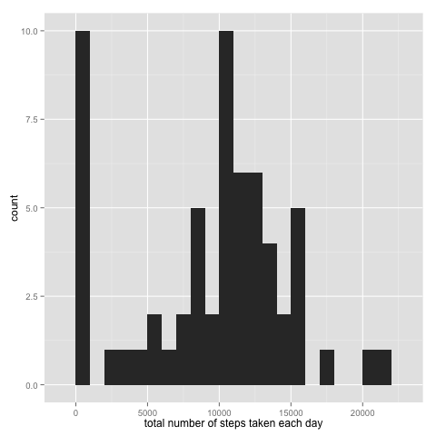
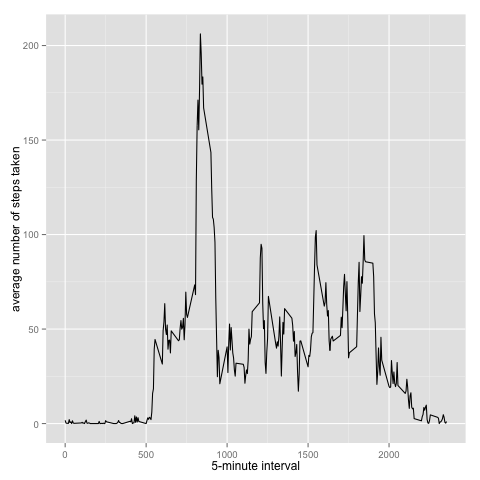
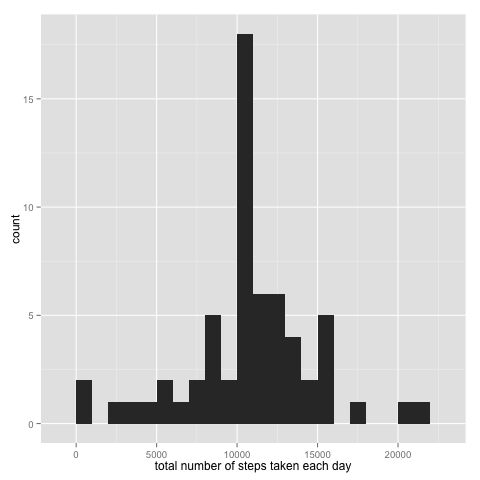
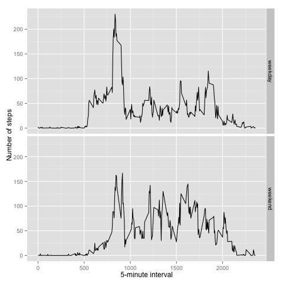

# Loading and preprocessing the data

```r
data<- read.csv("activity.csv")
```

# What is mean total number of steps taken per day?
1. Calculate the total number of steps taken per day

```r
T_steps <- tapply(data$steps, data$date, FUN=sum, na.rm = TRUE)
```

2. Make a histogram of the total number of steps taken each day

```r
library(ggplot2)
qplot(T_steps, geom = "histogram", binwidth = 1000, xlab = "total number of steps taken each day")
```

 

3. Calculate and report the mean and median of the total number of steps taken per day.

```r
Mean_steps<- mean(T_steps, na.rm = TRUE)
Median_steps<- median(T_steps, na.rm = TRUE)
```
The mean of the total number of steps taken per day is 9354.2295082. The median of the total number of steps taken per day is 10395.

# What is the average daily activity pattern?
1. Make a time series plot of the 5-minute interval and the average number of steps taken, averaged across all days.

```r
Average_steps <- aggregate(x = list(steps = data$steps), by = list(interval = data$interval), FUN = mean, na.rm = TRUE)
library(ggplot2)
ggplot(data = Average_steps, aes(x = interval, y = steps)) + geom_line() + xlab("5-minute interval") + ylab("average number of steps taken") 
```

 

2. Which 5-minute interval, on average across all the days in the dataset, contains the maximum number of steps?

```r
Max_index<- which(Average_steps == max(Average_steps))
Max_interval<- data$interval_revised[Max_index]
```
The th 5-minute interval contains the maximum number of steps.

# Imputing missing values
1. Calculate and report the total number of missing values in the dataset.

```r
Missing_value<- sum(is.na(data$steps))
```
The total number of missing values in the dataset is 2304.

2. Devise a strategy for filling in all of the missing values in the dataset.
  
  **Strategy**
  - Create a new column in the dataset with the heading of *Average_steps*, and the value equal to the average steps taken accorss all days. 
  - Add a new column called steps_revised. 
  - For each row, if the value in *steps* column is a missing value, add the value in the *Average_steps* column to the *steps_revised* column; if the value in the in *steps* column is not a missing value, add the value in the *steps* column to the *steps_revised* column.
  - Create a new dataframe with three columns with the values from *steps_revised*, *date*, and *interval*.

3. Create a new dataset that is equal to the original dataset but with the missing data filled in.

```r
for(i in 0:60)
  {
   for(j in 1:288)
     {
     data$Average_steps[288*i+j]<- Average_steps[j, 2]
     }
  }
  
for(i in seq(nrow(data)))
  {
    if (is.na(data[i, "steps"])) 
      {
        data$steps_revised[i] <- data[i, "Average_steps"]
      }  
    else {
           data$steps_revised[i] <- data[i, "steps"]
        }
  }
data_revised<- data.frame(steps = data$steps_revised, date = data$date, interval = data$interval)
```

4. Make a histogram of the total number of steps taken each day and Calculate and report the mean and the median total number of steps taken per day. Do these values differ from the estimates from the first part of the assignment? What is the impact of imputing missing data on the estimates of the total daily number of steps?

```r
T_steps_revised <- tapply(data_revised$steps, data_revised$date, FUN=sum )
library(ggplot2)
qplot(T_steps_revised, geom = "histogram", binwidth = 1000, xlab = "total number of steps taken each day")
```

 


```r
Mean_steps_revised<- mean(T_steps_revised)
Median_steps_revised<- median(T_steps_revised)
```
For the revised data, the mean of the total number of steps taken per day is 1.0766189 &times; 10<sup>4</sup>; and the median of the total number of steps taken per day is 1.0766189 &times; 10<sup>4</sup>. The mean and the median for the revised data are very close to the mean and the median for the original data. Therefore, imputing missing data has no big impact on the estimates of the total daily number of steps.

# Are there differences in activity patters between weekdays and weekends?

1. Create a new factor variable in the dataset with two levels - "weekday" and "weekend" indicating whether a given date is a weekday or weekend day.

```r
Day_type <- function(date) {
 day<- weekdays(date)
 if (day %in% c("Monday", "Tuesday", "Wednesday", "Thursday", "Friday"))
   return("weekday") 
 else if (day %in% c("Saturday", "Sunday"))
   return("weekend")
 else stop("Invalid date")
}
data_revised$date<- as.Date(data_revised$date)
data_revised$day<- sapply(data_revised$date, FUN = Day_type)
```

2. Make a panel plot containing a time series plot of the 5-minute interval and the average number of steps taken, averaged across all weekday days or weekend days.

```r
averages<- aggregate(steps ~ interval + day, data = data_revised, mean)
ggplot(averages, aes(interval, steps)) + geom_line() + facet_grid(day ~ .) + xlab("5-minute interval") + ylab("Number of steps")
```

 
